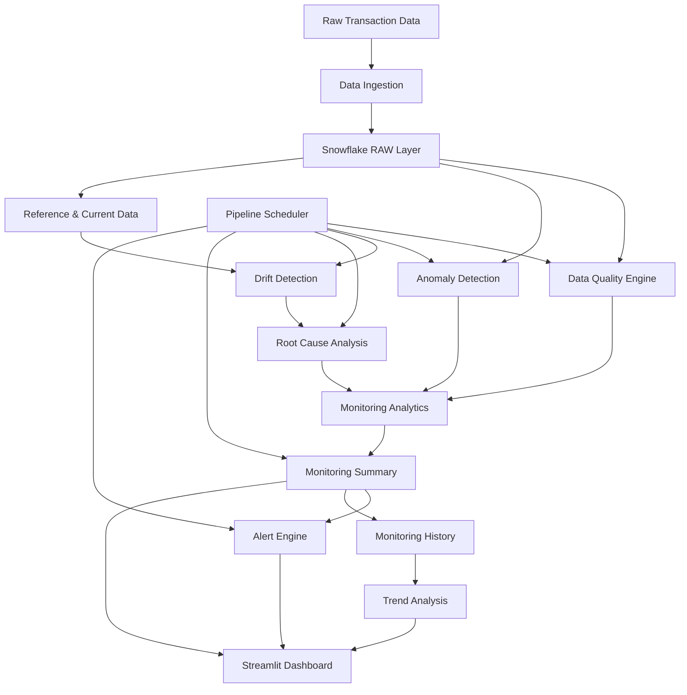

# ❄️ SnowGuard

### AI-Powered Data Quality & Anomaly Detection Platform

> **Detect. Diagnose. Monitor. Act.**

SnowGuard is an end-to-end data monitoring platform designed to evaluate data quality, detect anomalies, identify statistical drift, perform root-cause analysis, generate actionable alerts, and track monitoring health over time.

Built with **Python, Snowflake, Machine Learning, Statistical Analysis, and Streamlit**, SnowGuard brings data reliability and monitoring into one unified workflow.

---

## 🚀 Why SnowGuard?

Modern data pipelines can silently degrade because of:

- Missing or invalid data
- Duplicate records
- Unexpected or abnormal transactions
- Distribution changes in important features
- Changes in customer or transaction behavior
- Data quality degradation over time

SnowGuard addresses these challenges through a structured monitoring pipeline:

```text
Raw Data
   ↓
Data Quality Validation
   ↓
Anomaly Detection
   ↓
Drift Detection
   ↓
Root-Cause Analysis
   ↓
Monitoring Summary
   ↓
Alert Generation
   ↓
Dashboard & Historical Monitoring
```

---

## ✨ Key Features

| Module | Capability |
|---|---|
| 🧹 Data Quality | Detect missing values, duplicates, invalid values, and inconsistent records |
| 🚨 Anomaly Detection | Identify unusual transactions using Isolation Forest |
| 📊 Drift Detection | Detect statistical distribution changes using the KS Test |
| 🔍 Root-Cause Analysis | Analyse contributing categories, cities, and payment methods |
| 📈 Monitoring Summary | Combine monitoring signals into a unified health summary |
| 🔔 Alert Engine | Generate alerts for anomalies, drift, and system health |
| 🕒 Pipeline Scheduler | Execute the monitoring workflow automatically |
| 📚 Pipeline History | Track pipeline runs and execution performance |
| 📉 Trend Analysis | Analyse monitoring snapshots over time |
| 💾 Snowflake Storage | Store raw, processed, quality, and analytics data |
| 🖥️ Streamlit Dashboard | Interactive interface for monitoring all major modules |

---

# 🏗️ System Architecture



---

# 🔄 End-to-End Monitoring Pipeline

SnowGuard follows a sequential monitoring architecture where each stage contributes to the final monitoring view.

| Stage | Purpose |
|---|---|
| 1. Generate / Ingest Data | Prepare raw and monitoring datasets |
| 2. Data Quality | Validate completeness and consistency |
| 3. Anomaly Detection | Detect unusual records |
| 4. Drift Detection | Identify statistical distribution changes |
| 5. Root-Cause Analysis | Investigate dimensions contributing to changes |
| 6. Monitoring Summary | Combine monitoring signals |
| 7. Alert Engine | Generate structured alerts |
| 8. Historical Snapshot | Store monitoring state for trend analysis |

---

# 🔎 Monitoring Modules

## 1. 🧹 Data Quality Engine

The Data Quality Engine validates transactional data using multiple quality rules.

### Checks Performed

| Check | Purpose |
|---|---|
| Missing Values | Identify incomplete records |
| Duplicate Transactions | Detect repeated records |
| Invalid Ages | Detect values outside expected conditions |
| Negative Amounts | Identify invalid transaction amounts |
| Category Consistency | Check category validity and consistency |

### Verified Result

| Metric | Result |
|---|---:|
| Records Analysed | 1,015 |
| Quality Score | **98.58%** |
| Quality Status | **GOOD** |

---

## 2. 🚨 Anomaly Detection

SnowGuard uses **Isolation Forest** to identify unusual transaction records.

### Features Analysed

| Feature |
|---|
| AGE |
| INCOME |
| AMOUNT |

### Detection Configuration

| Parameter | Value |
|---|---|
| Algorithm | Isolation Forest |
| Estimators | 200 |
| Contamination | 0.05 |
| Random State | 42 |
| Missing Values | Median Imputation |

### Verified Result

| Metric | Result |
|---|---:|
| Normal Records | 964 |
| Anomalies | **51** |
| Anomaly Rate | **5.02%** |

---

## 3. 📊 Drift Detection

SnowGuard detects statistical changes between reference and current datasets using the **Kolmogorov-Smirnov (KS) Test**.

### Monitored Features

| Feature | Reference Mean | Current Mean | Status |
|---|---:|---:|---|
| AGE | 41.90 | 43.22 | STABLE |
| INCOME | 66,063.35 | 82,355.18 | **HIGH** |
| AMOUNT | 2,932.10 | 4,960.73 | **HIGH** |

### Drift Result

| Metric | Result |
|---|---:|
| Drifted Features | **2** |
| Drift Status | **HIGH** |

---

## 4. 🔍 Root-Cause Analysis

Detecting drift is only the first step. SnowGuard analyses contributing dimensions to provide additional context around observed changes.

### Analysed Dimensions

| Dimension |
|---|
| CATEGORY |
| CITY |
| PAYMENT_METHOD |

### Root-Cause Analysis Flow

```text
Detected Drift
      ↓
Affected Feature
      ↓
Dimension Analysis
      ↓
Contribution Analysis
      ↓
High-Contribution Groups
```

### Verified Result

| Metric | Result |
|---|---:|
| RCA Records Generated | **30** |

---

# 📋 Monitoring Summary

SnowGuard consolidates the major monitoring signals into one system-level view.

### Example Monitoring Snapshot

| Metric | Result |
|---|---|
| Records Analysed | 1,015 |
| Data Quality Score | 98.58% |
| Quality Status | GOOD |
| Anomalies | 51 |
| Anomaly Rate | 5.02% |
| Drifted Features | 2 |
| Drift Status | HIGH |
| RCA Records | 30 |
| Overall Monitoring Status | **CRITICAL** |

> The overall monitoring status reflects the combined monitoring signals and is separate from infrastructure/system availability.

---

# 🔔 Alert Engine

SnowGuard converts important monitoring conditions into structured alerts.

### Alert Categories

| Alert Type | Purpose |
|---|---|
| ANOMALY_DETECTION | Reports abnormal records and anomaly rate |
| DATA_DRIFT | Reports statistically significant feature drift |
| SYSTEM_HEALTH | Reports overall monitoring health |

### Example Alerts

| Severity | Alert |
|---|---|
| WARNING | 51 anomalous records detected with a 5.02% anomaly rate |
| CRITICAL | Data drift detected in INCOME and AMOUNT |
| CRITICAL | Overall monitoring status is CRITICAL |

Alerts are stored in Snowflake for monitoring and analysis.

---

# 🕒 Automated Pipeline Execution

SnowGuard supports automated execution of the complete monitoring workflow.

### Pipeline Flow

```text
Generate Drift Data
        ↓
Data Quality
        ↓
Anomaly Detection
        ↓
Drift Detection
        ↓
Root Cause Analysis
        ↓
Monitoring Summary
        ↓
Alert Engine
```

Each pipeline execution records:

| Execution Information |
|---|
| Run ID |
| Start Time |
| End Time |
| Duration |
| Stage Status |
| Step-Level Logs |

### Example Successful Run

| Metric | Result |
|---|---|
| Run ID | `20260923_104429_127` |
| Steps | **7 / 7** |
| Status | **SUCCESS** |
| Duration | **136.69 seconds** |

---

# 📚 Pipeline History

SnowGuard stores pipeline execution metadata to provide operational visibility across multiple runs.

### Tracked Information

- Pipeline run status
- Step-level execution status
- Execution duration
- Start and end timestamps
- Historical run information

This makes it possible to identify slow pipeline stages and observe execution behaviour over time.

---

# 📈 Trend Analysis

SnowGuard maintains monitoring snapshots in an append-only history table.

### Historical Monitoring Signals

| Signal |
|---|
| Quality Score |
| Anomaly Count |
| Anomaly Rate |
| Drift Features |
| Monitoring Status |
| Pipeline Execution History |

```text
Current Snapshot
       ↓
Monitoring History
       ↓
Historical Comparison
       ↓
Trend Analysis
```

---

# 🖥️ Interactive Streamlit Dashboard

SnowGuard provides a **Streamlit-based monitoring dashboard** for interactive analysis.

## Dashboard Pages

| Page | Purpose |
|---|---|
| Overview | High-level system and monitoring summary |
| ⚡ Run Monitoring | Execute and observe the monitoring pipeline |
| Data Quality | Inspect data quality metrics and results |
| Anomaly Detection | Explore detected anomalies |
| Drift Detection | Analyse feature-level drift |
| Root Cause Analysis | Investigate contributing dimensions |
| Alerts & Recommendations | View active alerts and monitoring recommendations |

### Dashboard Capabilities

- System health overview
- Data quality metrics
- Anomaly statistics
- Drift analysis
- Root-cause visualizations
- Alert monitoring
- Pipeline execution status
- Historical monitoring
- Interactive tables and charts

---

# ☁️ Snowflake Data Architecture

SnowGuard uses Snowflake as the centralized data warehouse and analytics storage layer.

```text
SNOWGUARD_DB
│
├── RAW
│   └── TRANSACTIONS_RAW
│
├── QUALITY
│   ├── QUALITY_RESULTS
│   ├── ANOMALY_RESULTS
│   └── DRIFT_RESULTS
│
├── PROCESSED
│   ├── TRANSACTIONS_REFERENCE
│   └── TRANSACTIONS_CURRENT
│
└── ANALYTICS
    ├── ROOT_CAUSE_RESULTS
    ├── MONITORING_SUMMARY
    ├── ALERT_RESULTS
    ├── PIPELINE_RUNS
    ├── PIPELINE_STEP_RUNS
    └── MONITORING_HISTORY
```

---

# 🛠️ Technology Stack

| Area | Technologies |
|---|---|
| Programming | Python |
| Data Processing | Pandas, NumPy |
| Machine Learning | Scikit-learn, Isolation Forest |
| Statistical Analysis | SciPy, Kolmogorov-Smirnov Test |
| Data Warehouse | Snowflake, Snowpark |
| Dashboard | Streamlit, Matplotlib |
| Configuration | python-dotenv |
| Containerization | Docker, Docker Compose |
| Version Control | Git, GitHub |

---

# 📂 Project Structure

```text
SnowGuard/
│
├── app/
│   ├── anomaly/
│   │   └── anomaly_detector.py
│   │
│   ├── analytics/
│   │   ├── alert_engine.py
│   │   ├── monitoring_summary.py
│   │   ├── root_cause.py
│   │   └── trend_analysis.py
│   │
│   ├── drift/
│   │   ├── drift_detector.py
│   │   └── generate_drift_data.py
│   │
│   ├── monitoring/
│   │   └── health_check.py
│   │
│   ├── pipeline/
│   │   ├── pipeline_history.py
│   │   ├── run_and_history.py
│   │   ├── run_pipeline.py
│   │   └── scheduler.py
│   │
│   ├── quality/
│   │   └── quality_engine.py
│   │
│   └── dashboard.py
│
├── data/
│   └── raw/
│
├── sql/
│
├── Dockerfile
├── docker-compose.yml
├── requirements.txt
├── .gitignore
└── README.md
```

> The `.env` file is intentionally excluded from version control.

---

# ⚙️ Installation

## 1. Clone the Repository

```bash
git clone https://github.com/Afreenshaik07/SnowGuard.git
cd SnowGuard
```

## 2. Create a Virtual Environment

### Windows

```powershell
python -m venv .venv
.venv\Scripts\Activate.ps1
```

### Linux / macOS

```bash
python3 -m venv .venv
source .venv/bin/activate
```

## 3. Install Dependencies

```bash
pip install -r requirements.txt
```

---

# 🔐 Environment Configuration

Create a `.env` file in the project root.

```env
SNOWFLAKE_ACCOUNT=your_account
SNOWFLAKE_USER=your_username
SNOWFLAKE_PASSWORD=your_password
SNOWFLAKE_WAREHOUSE=SNOWMONITOR
SNOWFLAKE_DATABASE=SNOWGUARD_DB
SNOWFLAKE_SCHEMA=RAW
SNOWFLAKE_ROLE=ACCOUNTADMIN
```

Never commit credentials or secrets to GitHub.

---

# ▶️ Run SnowGuard

## Start the Dashboard

```bash
streamlit run app/dashboard.py
```

The Streamlit application runs on:

```text
http://localhost:8501
```

## Run the Complete Pipeline

```bash
python app/pipeline/run_pipeline.py
```

## Run the Pipeline and Save Monitoring History

```bash
python app/pipeline/run_and_history.py
```

## Run the Health Check

```bash
python app/monitoring/health_check.py
```

## Run Trend Analysis

```bash
python app/analytics/trend_analysis.py
```

---

# 🐳 Docker Support

SnowGuard includes Docker configuration for containerized execution.

## Build and Start

```bash
docker compose up --build
```

## Run in Background

```bash
docker compose up -d
```

## Stop Services

```bash
docker compose down
```

### Docker Services

| Service | Purpose | Port |
|---|---|---:|
| Dashboard | Streamlit monitoring dashboard | 8501 |
| Scheduler | Automated pipeline execution | — |

---

# 🧪 Verified System Results

The implemented SnowGuard pipeline has been executed successfully with the following monitoring results.

| Metric | Verified Result |
|---|---:|
| Records Analysed | 1,015 |
| Data Quality Score | **98.58%** |
| Quality Status | **GOOD** |
| Normal Records | 964 |
| Anomalies | **51** |
| Anomaly Rate | **5.02%** |
| Drifted Features | **2** |
| Drift Status | **HIGH** |
| RCA Records | **30** |
| Generated Alerts | **3** |
| Pipeline Stages | **7 / 7** |
| Latest Pipeline Status | **SUCCESS** |

---

# 🩺 System Health

SnowGuard separates **infrastructure health** from **data monitoring health**.

### Infrastructure Health

| Check | Status |
|---|---|
| Snowflake Connection | **HEALTHY** |
| Pipeline Execution | **HEALTHY** |
| System Check | **PASSED** |

### Monitoring Health

| Signal | Status |
|---|---|
| Data Quality | **GOOD** |
| Anomaly Monitoring | **ACTIVE** |
| Drift Monitoring | **CRITICAL** |
| Overall Monitoring | **CRITICAL** |

This distinction separates:

```text
"Is the system running?"
              from
"Is the monitored data healthy?"
```

---

# 🔒 Security

SnowGuard follows basic credential-protection practices:

- Snowflake credentials are stored in `.env`
- `.env` is excluded through `.gitignore`
- Credentials are not hardcoded in source files
- Secrets remain outside the Git repository

---

# 📊 Project Highlights

| Capability | Status |
|---|---|
| End-to-End Monitoring Pipeline | ✅ |
| Data Quality Validation | ✅ |
| ML-Based Anomaly Detection | ✅ |
| Statistical Drift Detection | ✅ |
| Root-Cause Analysis | ✅ |
| Automated Alert Generation | ✅ |
| Historical Monitoring | ✅ |
| Pipeline Execution Tracking | ✅ |
| Streamlit Dashboard | ✅ |
| Snowflake Analytics Storage | ✅ |
| Docker Support | ✅ |
| GitHub Repository | ✅ |

---

# 🔮 Future Scope

Potential extensions include:

- Automated model retraining
- Advanced drift detection methods
- Real-time streaming data monitoring
- ML-based root-cause ranking
- Email, Slack, or Teams notifications
- Role-based access control
- Advanced observability metrics
- Cloud deployment
- Explainable anomaly detection
- Data lineage integration
- Multi-dataset monitoring
- Production-grade MLOps integration

---

# 🎯 Project Objective

SnowGuard is designed to answer four core data reliability questions:

```text
1. Is the data valid?
        ↓
2. Are there unusual records?
        ↓
3. Has the data distribution changed?
        ↓
4. What is contributing to the change?
```

These capabilities are combined into a single monitoring workflow backed by Snowflake and exposed through an interactive Streamlit dashboard.

---

# 💡 Core Value Proposition

```text
                    SNOWGUARD
                        │
          ┌─────────────┼─────────────┐
          │             │             │
          ▼             ▼             ▼
       QUALITY      ANOMALIES        DRIFT
          │             │             │
          └─────────────┼─────────────┘
                        ▼
                 ROOT-CAUSE
                   ANALYSIS
                        │
                        ▼
                MONITORING HEALTH
                        │
                        ▼
                     ALERTS
                        │
                        ▼
                   DASHBOARD
```

> **SnowGuard transforms raw data monitoring into an actionable data reliability workflow.**

---

# 👩‍💻 Author

## Afreen Shaik

**B.Tech — Computer Science & Engineering (Data Science)**

GitHub: [@Afreenshaik07](https://github.com/Afreenshaik07)

---

# 🔗 Repository

[](https://github.com/Afreenshaik07/SnowGuard)

[](https://www.python.org/)

[](https://www.snowflake.com/)

[](https://streamlit.io/)

[](https://www.docker.com/)

---

## ❄️ SnowGuard

### **Detect. Diagnose. Monitor. Act.**

**An intelligent data quality and monitoring platform built for reliable data operations.**
